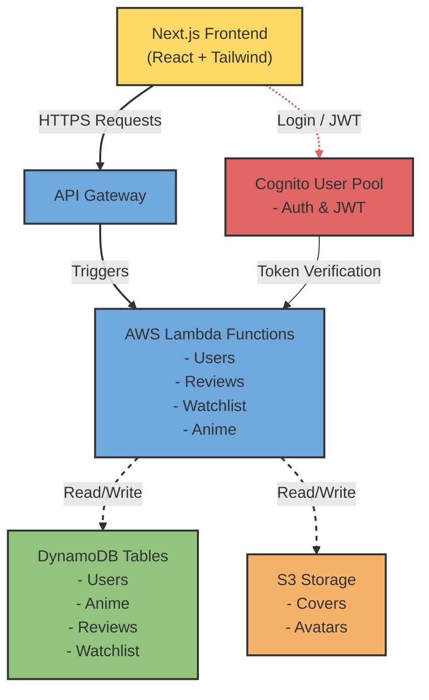

Website for ranking and making lists of all your favourite anime and manga!

# 🌸 Anirank — Anime Ratings & Review Platform  
A modern full-stack anime rating, review, and discovery web app built with **Next.js**, **React**, and **AWS**.  
This project was developed as a third-year Software Development capstone project.

---

## 🚀 Features

### ⭐ Core Functionality
- Browse anime with detailed information (title, synopsis, genres, rating, etc.)
- User authentication with **AWS Cognito**
- Rate and review anime
- User profiles with:
  - Watchlists
  - Favourite anime
  - Review history
- Search and filter by genre, rating, or popularity

### 💬 Community Features
- Comments on anime pages
- Upvotes on reviews
- Trending anime algorithm based on user activity

### 🎯 Recommendation Engine
- Personalized anime recommendations based on:
  - User ratings
  - Preferred genres
  - Viewing history

### 📊 Admin Tools
- Anime database management
- Review moderation
- User analytics panel

---

## 🛠️ Tech Stack

### **Frontend**
- **Next.js 14**
- **React**
- **TailwindCSS** for styling

### **Backend / AWS**
- **AWS Cognito** for authentication
- **AWS DynamoDB** for data storage  
- **AWS Lambda** (serverless functions for API logic)  
- **AWS S3** (image & asset storage)
- **AWS API Gateway** (REST endpoints)

### **Other Tools**
- **Jikan API** (optional alternative to pull anime metadata)
- **TypeScript**
- **ESLint + Prettier**

---
## 📁 Project Structure
```plaintext
anirank/
├── src/
│   ├── app/        # Next.js 14 App Router
│   ├── components/ # Reusable UI components
│   ├── hooks/      # Custom React hooks
│   ├── lib/        # API and utility functions
│   ├── styles/     # Global styles
│   └── types/      # TypeScript definitions
├── public/         # Static assets
├── package.json
└── README.md
```

---

## ⚙️ Getting Started

### 1️⃣ Clone the repository
```bash
git clone https://github.com/Adam-Kelly-05/Anirank.git
cd anirank
```
### 2️⃣ Install dependencies
```bash
npm install
```
### 3️⃣ Configure environment variables
Create a .env.local file at the root of your project with:
```env
NEXT_PUBLIC_AWS_REGION=your-region
NEXT_PUBLIC_COGNITO_USER_POOL_ID=xxx
NEXT_PUBLIC_COGNITO_CLIENT_ID=xxx
NEXT_PUBLIC_API_URL=https://your-api-endpoint
```

### 4️⃣ Run the development server
```bash
npm run dev
```

🏗️ Architecture Diagram


📜 License  
This project is licensed under the MIT License. See the LICENSE file for details.


🌸 Thank you for checking out Anirank! Feedback and contributions are welcome


